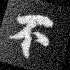

# README

## Environment
* python 3.6.2
``` bash
conda create -n Datasets python=3.6
```
* packages
``` bash
pip install -r requirements.txt
```

## How to run
There are two steps for image augmentation. The first step is applying shading effect by `replacing background with gradient image` and `adjusting intensity of foreground`. The second step is applying common augmentations, including `perspective transform`, `rotation`, `Gaussian blur` and `Gaussian noise`.

Applied augmentations:
1. background replacement
2. foreground adjustment
3. perspective transform
4. rotation
5. Gaussian blur
6. Gaussian noise

Run the codes by calling `aug_image()` in `augmentation.py`.
```python
import cv2
from augmentation import aug_image

img_src = cv2.imread('./img_src.png')
img_out = aug_image(img_src)
```

## Examples
|  Before   | After  |
|  ----  | ----  |
|   |  |

